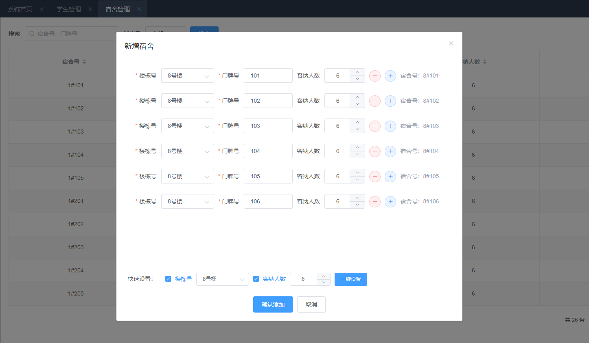
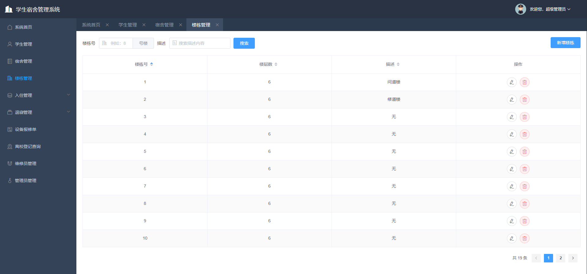
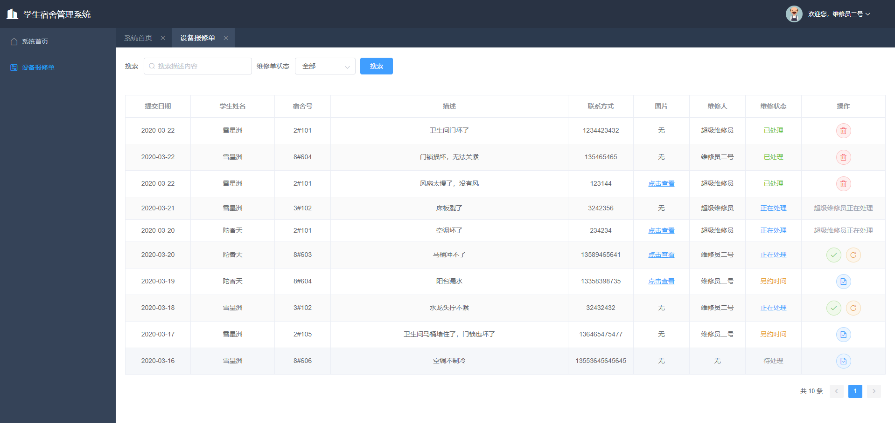

# 学生宿舍管理系统

本系统是我的毕业设计个人作品，采用前后端分离进行开发。前端使用Vue.js + VueX + VueRouter + Element-UI，后端使用Node.js + Egg.js + MongoDB。主要功能包括宿舍管理，学生管理，设备保修，楼栋管理，分配宿舍，退寝管理等等。本系统一共有3个不同的账号角色，为管理员、学生、维修员，分别对应不同的功能，权限。

## 项目地址

**项目线上地址：**<http://dodopo.cn/dorm>  

**项目Git地址：**  
前端：<https://gitee.com/tym98/graduation_frontend>  
后端：<https://gitee.com/tym98/graduation_backend>  

## 技术栈

* 前端使用Vue.js + VueX + VueRouter + Element-UI 进行开发
* 使用Vue-Cli搭建前端工程
* 使用SCSS预处理器
* 使用Axios进行ajax请求。
* 使用echarts构建图表
* 后端使用Node.js搭建
* 使用MongoDB作为数据库
* 使用Mongoose驱动数据库
* 使用Egg.js作为Web框架。
* 使用node-xlsx解析xlsx文件

## 主要功能

* 学生管理：添加学生、删除学生、修改学生信息、查询学生，使用Excel批量导入学生，指定学生宿舍。
* 分配宿舍：批量为指定的学生指定宿舍。
* 调整宿舍：学生可以发起调整宿舍申请，管理员同意后，即可更换宿舍。
* 批量办理退寝：管理员可以批量为学生办理退寝。
* 退寝审批：学生如果需要退寝，可以填写退寝表，管理员同意后，即可退寝。
* 设备报修单：学生如果需要对损坏设备进行报修，可以在本系统进行设备报修登记，然后再由维修员进行处理。
* 离校登记：节假日或其他原因，学生需要暂时离校，即可直接在本系统进行离校登记，管理员可以进行查询。
* 宿舍管理：添加宿舍、删除宿舍、修改宿舍信息、查询，筛选宿舍。
* 楼栋管理：添加楼栋、删除楼栋、修改楼栋信息、查询，筛选楼栋。
* 账号管理：本系统所有的账号都是由管理员进行添加的，管理员可以在本系统对账号进行添加、查询、修改、删除。

## 效果展示

### 系统首页


### 系统登录


### 学生管理


### 批量导入学生


### 宿舍管理


### 添加宿舍



### 分配宿舍


### 学生宿舍安排


### 楼栋管理



### 设备报修单



### 学生填写设备报修单


## 运行

```bash
$ npm i
$ npm run serve
$ open http://localhost:7415/
```

## 构建部署

```bash
$ npm run build
```

## 最后

本系统由我个人独自开发完成，因此仍有一些地方不够完善，可能存在某些BUG，欢迎各位大佬在Issues进行留言，感谢！

